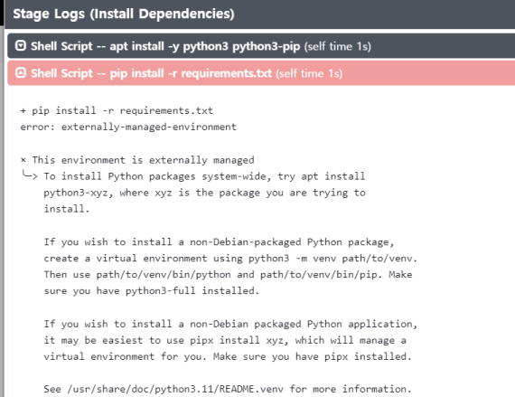
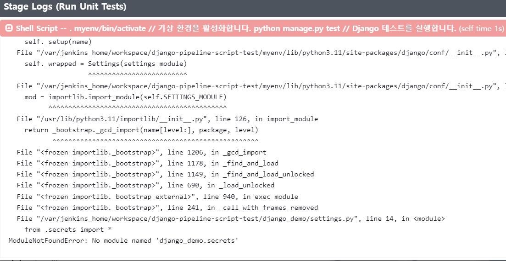

# Jenkins CI/CD Test Guide for Django Project

## 필요한 사전 조건

- Jenkins가 설치된 서버 (도커로 실행 가능)
- GitHub 레포지토리에 장고 프로젝트가 저장되어 있어야 함 (테스트 프로젝트)

## Jenkinsfile 생성

1. 프로젝트 루트 디렉토리에 `Jenkinsfile`을 생성합니다.
2. 아래의 예시 코드를 `Jenkinsfile`에 붙여넣습니다.

```groovy
pipeline {
    agent any

    environment {
        DJANGO_SETTINGS_MODULE = 'django_demo.settings'
    }

    triggers {
        pollSCM('H/5 * * * *')
    }

    stages {
        stage('Checkout from GitHub') {
            steps {
                checkout([$class: 'GitSCM', branches: [[name: '*/main']], doGenerateSubmoduleConfigurations: false, extensions: [], submoduleCfg: [], userRemoteConfigs: [[url: 'https://github.com/jinhoDevOps/django_demo.git']]])
            }
        }

        stage('Install Dependencies') {
            steps {
                sh 'pip install -r requirements.txt'
            }
        }

        stage('Run Unit Tests') {
            steps {
                sh 'python manage.py test'
            }
        }

        stage('Build Docker Image') {
            steps {
                sh 'docker build -t django_demo .'
            }
        }

        stage('Deploy to Docker Container') {
            steps {
                sh 'docker run -d -p 8000:8000 django_demo'
            }
        }
    }
}
```

## Jenkins 설정

1. Jenkins 웹 UI에 접속합니다. (http://[your-server-ip]:9090)
2. 'New Item'을 클릭합니다.
3. 이름을 입력하고 'Pipeline'을 선택한 후, 'OK'를 클릭합니다.
4. 이후 설정에서 'Pipeline' 섹션으로 스크롤합니다.
5. 'Definition'을 'Pipeline script from SCM'으로 설정합니다.
6. 'SCM'을 'Git'으로 선택합니다.
7. 'Repository URL'에 GitHub 레포지토리의 URL`https://github.com/jinhoDevOps/django_demo.git`을 입력합니다.
8. 'Save'를 클릭합니다.

이렇게 설정하면 Jenkins가 5분마다 GitHub 레포지토리를 체크하여 변경 사항이 있으면 자동으로 파이프라인을 실행합니다.
[Jenkins 빌드 오류](#jenkins-빌드-오류)

## 빌드 트리거

- Jenkins 설정에서 'Poll SCM'을 선택하고, 스케줄을 `H/5 * * * *`로 설정합니다. 이렇게 하면 5분마다 GitHub 레포지토리를 체크합니다.

## 빌드 및 배포 모니터링

- Jenkins 대시보드에서 빌드 및 배포 상태를 모니터링할 수 있습니다.

---

## Jenkins 빌드 오류

## 계속 추가하다가 내용 정리 필요

```bash
hudson.plugins.git.GitException: Command "git fetch --tags --force --progress --prune -- origin +refs/heads/master:refs/remotes/origin/master" returned status code 128:
stdout:
stderr: fatal: couldn't find remote ref refs/heads/master

	at org.jenkinsci.plugins.gitclient.CliGitAPIImpl.launchCommandIn(CliGitAPIImpl.java:2842)
	at org.jenkinsci.plugins.gitclient.CliGitAPIImpl.launchCommandWithCredentials(CliGitAPIImpl.java:2185)
	at org.jenkinsci.plugins.gitclient.CliGitAPIImpl$1.execute(CliGitAPIImpl.java:635)
	at jenkins.plugins.git.GitSCMFileSystem$BuilderImpl.build(GitSCMFileSystem.java:406)
	at jenkins.scm.api.SCMFileSystem.of(SCMFileSystem.java:219)
	at org.jenkinsci.plugins.workflow.cps.CpsScmFlowDefinition.create(CpsScmFlowDefinition.java:118)
	at org.jenkinsci.plugins.workflow.cps.CpsScmFlowDefinition.create(CpsScmFlowDefinition.java:70)
	at org.jenkinsci.plugins.workflow.job.WorkflowRun.run(WorkflowRun.java:311)
	at hudson.model.ResourceController.execute(ResourceController.java:101)
	at hudson.model.Executor.run(Executor.java:442)
Finished: FAILURE
```

Jenkins가 Git 레포지토리에서 `master` 브랜치를 찾을 수 없다고 에러 메시지가 나타나고 있습니다. 이 문제는 일반적으로 다음과 같은 경우에 발생할 수 있습니다:

1. 레포지토리에 `master` 브랜치가 없을 때: GitHub는 최근에 기본 브랜치 이름을 `main`으로 변경했습니다. 레포지토리의 기본 브랜치가 `main`인지 확인해 보세요.

2. 권한 문제: Jenkins가 레포지토리에 액세스할 수 있는지 확인해야 합니다.

### 브랜치 설정 오류

- **문제**: 'Branches to build'를 비워두면 'any'가 기본값으로 적용되어 'master' 브랜치가 빌드됩니다. 만약 'master' 브랜치가 없다면 빌드가 실패합니다.
- **해결 방법**: 'Branches to build'에 빌드하려는 브랜치의 이름을 명시적으로 입력합니다.

### 의존성 누락 오류

- **문제**: Jenkins가 실행되는 컨테이너에 필요한 의존성(예: Python)이 없을 경우 빌드가 실패합니다.
- **해결 방법**: Dockerfile이나 Jenkinsfile에서 필요한 의존성을 설치하는 단계를 추가합니다.

예: Dockerfile에 파이썬 설치 추가

```Dockerfile
# ... (기존 코드)

# Install Python3 and pip
RUN apt install -y python3 python3-pip

# ... (기존 코드)
```

또는 Jenkinsfile에서 파이썬 설치 단계 추가

```groovy
stage('Install Dependencies') {
    steps {
        sh 'apt install -y python3 python3-pip'  // Linux 패키지 의존성을 설치합니다.
        sh 'pip install -r requirements.txt'  // 파이썬 의존성을 설치합니다.
    }
}
```

이렇게 하면 필요한 의존성을 컨테이너에 설치하여 빌드 오류를 해결할 수 있습니다.
그러나 또 오류 발생


```sh
+ pip install -r requirements.txt // 파이썬 의존성을 설치합니다.
error: externally-managed-environment

× This environment is externally managed
╰─> To install Python packages system-wide, try apt install
    python3-xyz, where xyz is the package you are trying to
    install.

    If you wish to install a non-Debian-packaged Python package,
    create a virtual environment using python3 -m venv path/to/venv.
    Then use path/to/venv/bin/python and path/to/venv/bin/pip. Make
    sure you have python3-full installed.

    If you wish to install a non-Debian packaged Python application,
    it may be easiest to use pipx install xyz, which will manage a
    virtual environment for you. Make sure you have pipx installed.

    See /usr/share/doc/python3.11/README.venv for more information.

note: If you believe this is a mistake, please contact your Python installation or OS distribution provider. You can override this, at the risk of breaking your Python installation or OS, by passing --break-system-packages.
hint: See PEP 668 for the detailed specification.
```

이 오류는 시스템 전역에 파이썬 패키지를 설치하려고 할 때 발생합니다.
이는 일반적으로 권장되지 않으며, 가상 환경을 사용하는 것이 좋습니다.
Jenkinsfile에서 파이썬 가상 환경을 설정하고 그 안에서 의존성을 설치하는 단계를 추가할 수 있습니다.

아래는 Jenkinsfile에 파이썬 가상 환경을 설정하는 예시입니다:

```groovy
stage('Setup Python Environment') {  // 파이썬 가상 환경을 설정하는 단계
    steps {
        sh '''
        python3 -m venv myenv  // 가상 환경을 생성합니다.
        source myenv/bin/activate  // 가상 환경을 활성화합니다.
        '''
    }
}

stage('Install Dependencies') {  // 의존성을 설치하는 단계
    steps {
        sh '''
        source myenv/bin/activate  // 가상 환경을 활성화합니다.
        pip install -r requirements.txt  // 파이썬 의존성을 설치합니다.
        '''
    }
}
```

이렇게 하면 가상 환경 내에서 의존성을 설치할 수 있으며, 시스템 전역의 파이썬 환경을 변경하지 않습니다. Jenkinsfile의 나머지 단계에서도 이 가상 환경을 사용할 수 있습니다.

### 파이썬 의존성 문제

mysql 클라이언트 쓰려는데 libmysqlclient-dev 필요하다고 해서 추가했더니 오류발생  
마리아 db로 바뀌면서 이름이 변경됨 >> `default-libmysqlclient-dev`

### 환경변수 없어서 테스트 불가


Jenkins에서 환경 변수를 설정하는 방법은 여러 가지가 있습니다.

1. Jenkins 시스템 환경 변수 설정
   Jenkins 대시보드에서 `Manage Jenkins` > `Configure System`으로 이동하여 `Global properties` 섹션에서 `Environment variables`를 선택하고 환경 변수를 추가할 수 있습니다.

2. 파이프라인 스크립트에서 환경 변수 설정
   Jenkinsfile에서 `environment` 블록을 사용하여 환경 변수를 설정할 수 있습니다.

   ```groovy
   pipeline {
       agent any
       environment {
           DB_HOST = 'mysql.db.com'
           DB_PORT = '13306'
       }
       stages {
           // ...
       }
   }
   ```

3. 쉘 스크립트 단계에서 환경 변수 설정
   `sh` 단계에서 직접 환경 변수를 설정할 수도 있습니다.

   ```groovy
   stage('Set Environment Variables') {
       steps {
           sh '''
           export DB_HOST=mysql.db.com
           export DB_PORT=13306
           '''
       }
   }
   ```

4. Credentials Plugin을 사용한 환경 변수 설정  
   민감한 정보의 경우 Jenkins의 Credentials Plugin을 사용하여 안전하게 저장하고, 이를 환경 변수로 불러올 수 있습니다.

### Django - MySQL 연결 오류 
### 문제 상황
Docker와 Django를 사용하여 애플리케이션을 배포하는 과정에서 문제가 발생할 수 있습니다. 특히, Docker Compose를 사용하지 않고 독립적으로 Docker 컨테이너를 실행하는 경우에는 네트워크 설정과 데이터베이스 연결 설정에 주의해야 합니다.

만약 배포가 잘 되었지만 웹 애플리케이션에 접속이 안 되는 경우, 특히 다음과 같은 MySQL 연결 오류가 발생한다면:

- `(2005, "Unknown MySQL server host 'mysql.db.com' (-2)")`
- `(2013, "Lost connection to MySQL server at 'handshake: reading initial communication packet', system error: 11")`

다음 두 가지 주요 문제를 확인해야 합니다:

1. **MySQL 서버 설정**: `my.cnf` 파일 (Windows에서는 `my.ini`)에서 `bind-address` 설정을 확인하고, 필요하다면 `0.0.0.0`으로 설정하여 모든 IP에서의 접근을 허용해야 합니다.

2. **MySQL 사용자 권한**: MySQL 사용자가 원격 접속을 할 수 있는 권한을 가지고 있는지 확인해야 합니다. 이를 위해 다음과 같은 SQL 명령을 실행할 수 있습니다.
   ```sql
   GRANT ALL PRIVILEGES ON database.* TO 'username'@'%' IDENTIFIED BY 'password';
   ```